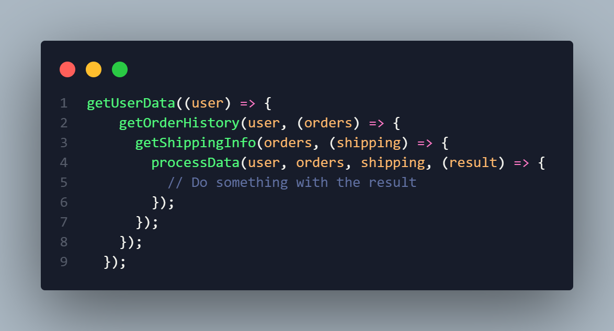
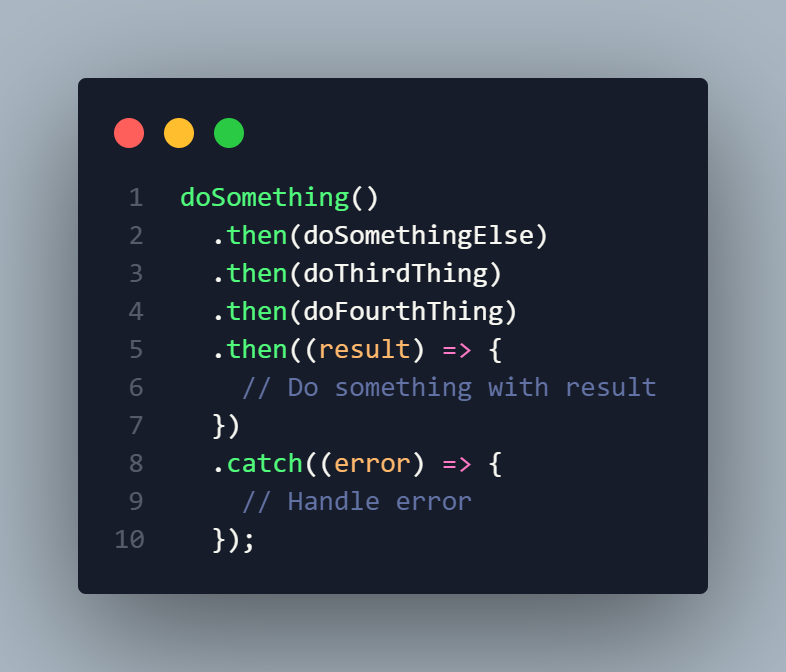

## Asynchronous operations using async/await over callback/promise TypeScript

Any developer looking to work in TypeScript must be ready to deal with several asynchronous actions. In order to deal with independent pieces of code which complete their operations without waiting, developers would either work with callbacks or promises, but the introduction of the `async/await` syntax has completely revolutionized the way asynchronous code is approached. This blog post will focus on how asynchronous code implemented with async/await is better as compared to funcition/callback/promise approach and how this can be achieved in TypeScript applications along with the discussion of this feature.

### Callback Hell and Promise Pyramid

Though promises and callbacks have been used by the majority of developers for a long time in the JavaScript and TypeScript programming languages, other techniques for handling Async actions are beginning to emerge. However, these techniques can easily lead to difficulties with a structure known as callback hell or the promise pyramid of doom.

**Callback Hell:** A complex function that nests many callbacks exhibits the feature of callback hell, which causes the complexity of the code to increase to a level that is difficult to read, manage, and debug. This is particularly prevalent in the context of complex asynchronous programs that rely on the completion of several tasks simultaneously.

**Promise Pyramid:** With the use of Promises, it becomes easier to handle asynchronous calls and the issue of callback hell is mitigated. You stack promises using the `.then()` and `.catch()` methods instead of nesting callbacks. And yet, as the number of asynchronous actions grows, the promise chain could also quickly become as unmanageable as callback hell.

### The Power of async/await

The way in which asynchronous code has been written changed a lot when the `async/await` appear in the TypeScript (and JavaScript) language. Code can easily be read, written, and maintained using this feature. You can still write asynchronous code that performs like synchronous code and looks like a synchronous code, which is much cleaner.

This demonstrates the `async/await` pattern and how it is used to shorten the code on its use.

In this instance, the `async/await` syntax eliminates the heavy `then` promisification as well as the nesting of callbacks, which in turn allows us to implement asynchronous code in a straight forward linear or sequential fashion. The `await` keyword makes the function to wait until the promise of the asynchronous operation is resolved, and this in turn greatly improves the readability.

Furthermore, the `try/catch` block allows us to handle any errors that may occur during the asynchronous operations, providing a more structured and robust error-handling mechanism.

### The Advantages of Using async/await
1. **Greater Readability and Maintenance**: Code is cleaner as there is no need to write long chains of promises or for multiple callbacks. This is particularly used for more difficult asynchronous calls. It will simplify the writing process, for instance, in this case it’s chaining.

2. **Simplified Exception Handling logic**: Now the async/await pattern includes an easy and handy method of catching exceptions – a `try/catch` block that is sort of common in programming which allows easier debugging and maintenance of code.

3. **Good for composing calls of asynchronous operations**: If you are using the async functions and have to await `async/await` in any occurrence, it’s easy to call one function to do that rather than chaining multiple promises or falling back onto nesting callbacks.

4. **Quick Learning Curve:** Developers working with `async/await` do not face ‘what method should I use?’ issues which relate to certain language features that use asynchronous operations, thus accelerating developer efficiency in the course of developing the TypeScript application

5. **Better Control of Promises**: It is apparent that the Promise API is the core of `async/await` so from this point around it is reasonable for programmers to encapsulate both asynchronous unique methodologies as well as retracing back to use promise implementations.

### Conclusion

Within this blog post, we focused on the drawbacks of the classical `callback/promise` pattern for managing asynchronous operation in TypeScript, and we introduced the benefits of using the `async/await` construct. Using `async/await` allows for writing of asynchronous code that is cleaner, easier to work with, more reliable, and in time enhances the entire development process.

As you persist with TypeScript remember to make use of `async/await` in most cases and that should place you in good stead as far as asynchronous programming is concerned.